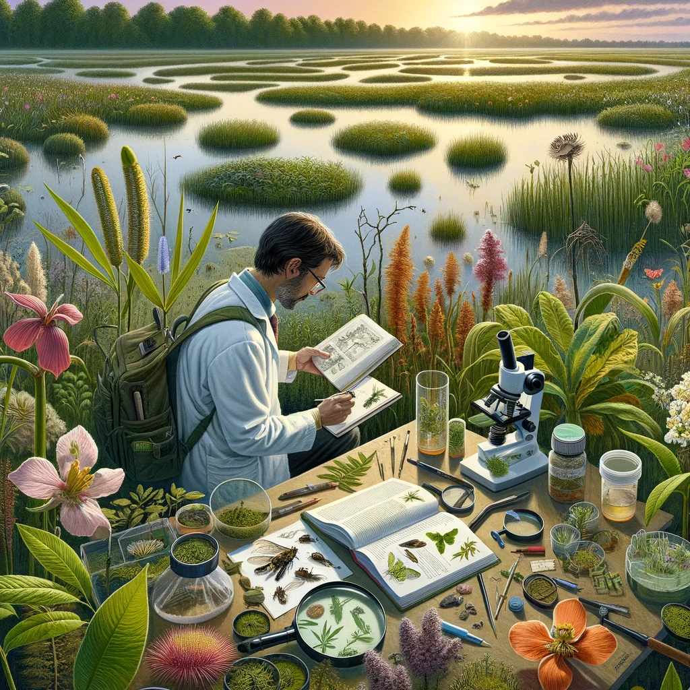
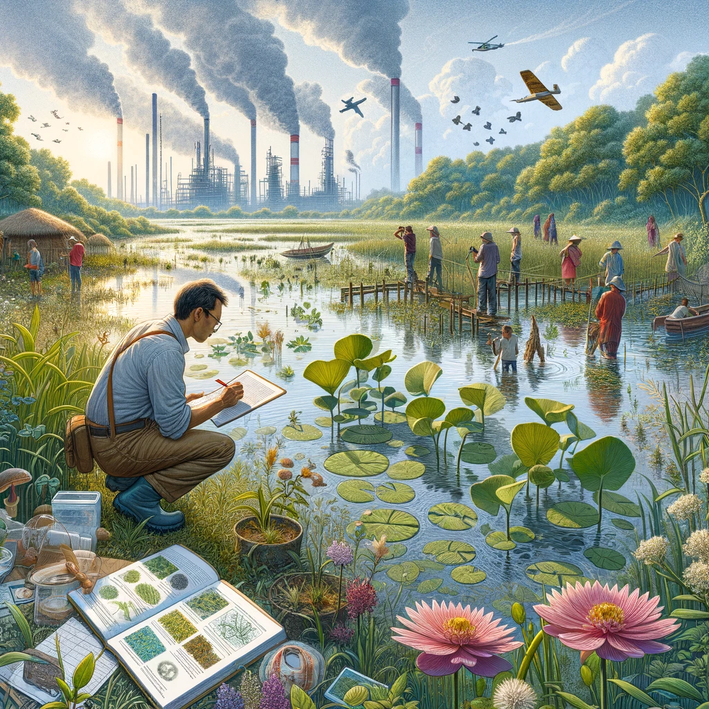
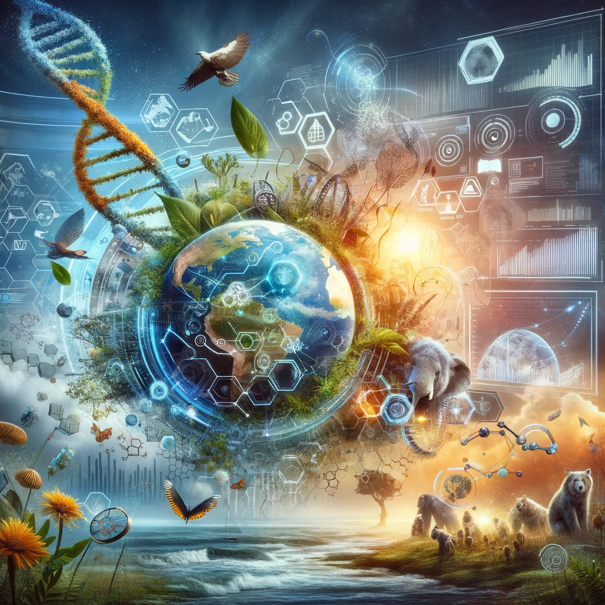

# About me

{ align=left width="250" }
As a dedicated PhD student in Biology, 
my academic and research endeavors are rooted in a profound commitment to understanding the multifaceted impacts of climate change on endemic plants. 
My work is not confined to conservation alone; it spans a broad spectrum of ecological studies, 
including vital projects on wetland ecosystems, taxonomical revisions of plant species, 
and the exploration of ethnobotanical knowledge. 
This diversity in research highlights my versatility and deep-seated curiosity about the natural world.

{ align=right width="250" }
In the realm of wetlands, 
my efforts are aimed at uncovering how these crucial ecosystems can be protected and restored in the face of environmental changes. 
Through taxonomical revisions, I strive to clarify the identity and relationships of plant species, 
a foundational step for effective conservation and ecological modeling. 
My interest in ethnobotany allows me to delve into the traditional knowledge surrounding plant use, 
fostering a greater understanding of human-plant interactions and their implications for biodiversity conservation.

{ align=left width="250" }
My scientific pursuits are augmented by a robust skill set in data science and software development, 
with a proficiency in Python, R, and JavaScript. 
I develop analytical tools and web applications that serve as bridges between technological innovation and ecological research, 
facilitating data-driven insights into ecological phenomena and conservation strategies.

{ align=right width="250" }
Engaging in this interdisciplinary work, 
I am committed to contributing to a deeper understanding of ecological dynamics, species preservation, 
and the sustainable management of natural resources. 
My goal is to merge scientific inquiry with technological advances to tackle ecological challenges, 
promote biodiversity, and ensure the resilience of ecosystems against the backdrop of climate change.