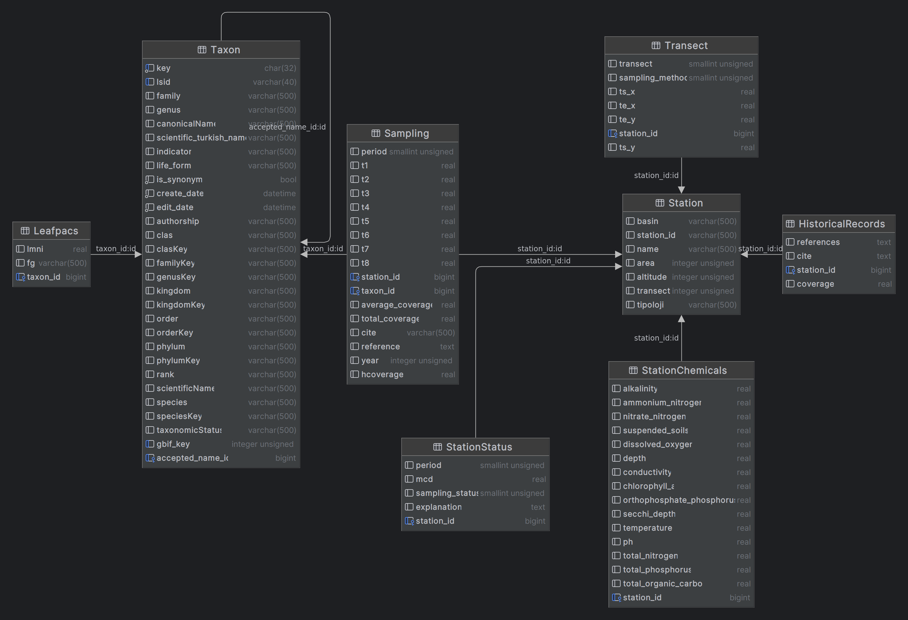
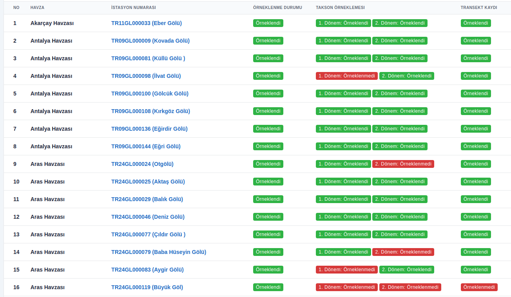
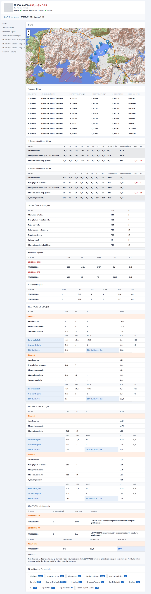

# Projects

### On-going Projects :material-progress-helper:

#### Herbarium Network of Türkiye

| Information      | Description                                                                                                                                                                                                                                                                                                                                                    |
|------------------|----------------------------------------------------------------------------------------------------------------------------------------------------------------------------------------------------------------------------------------------------------------------------------------------------------------------------------------------------------------|
| **Date**         | 2024 - present                                                                                                                                                                                                                                                                                                                                                 |
| **Organization** | Flora Research Association, İstanbul, Türkiye                                                                                                                                                                                                                                                                                                                  |
| **Role**         | Lead Developer                                                                                                                                                                                                                                                                                                                                                 |
| **Technologies** | :simple-python: Python :octicons-dot-fill-16: :simple-django: Django :octicons-dot-fill-16: :simple-postgresql: PostgreSQL (with PostGIS) :octicons-dot-fill-16: :material-api: Django REST Framework  :octicons-dot-fill-16: :simple-graphql: GraphQL :octicons-dot-fill-16: :simple-elasticsearch: Elasticsearch :octicons-dot-fill-16: :simple-react: React |
| **Link**         | [Herbarium Network of Türkiye](https://flora.org.tr)                                                                                                                                                                                                                                                                                                           |

Herbarium Network of Türkiye is carried out by the Flora Research Association, 
in cooperation with herbarium curators, in order to ensure effective communication of herbariums in Turkey, 
to digitize their collections and share them like similar examples in the world.

I am responsible for the development of the Herbarium Network of Türkiye.

#### TÜYAVE: Weed Database of Türkiye (yabanciot.org)

| Information      | Description                                                                                                                |
|------------------|----------------------------------------------------------------------------------------------------------------------------|
| **Date**         | 2023 - present                                                                                                             |
| **Organization** | -                                                                                                                          |
| **Role**         | Project Manager & Lead Developer                                                                                           |
| **Technologies** | :simple-python: Python :octicons-dot-fill-16: :simple-django: Django :octicons-dot-fill-16: :simple-postgresql: PostgreSQL |
| **Link**         | [TÜYAVE (yabanciot.org)](https://yabanciot.org)                                                                            |

I am responsible for the development of the Weed Database of Türkiye.
I created a database to store the data of weed literature and observations.
Then I created a web application to visualize the data.

#### Determination of Absorption Capacity in Lakes and Improvement of Water Quality

| Information      | Description                                                                                                                                                                |
|------------------|----------------------------------------------------------------------------------------------------------------------------------------------------------------------------|
| **Date**         | 2022 - present                                                                                                                                                             |
| **Organization** | Republic of Türkiye Ministry of Agriculture and Forestry                                                                                                                   |
| **Role**         | Data Scientist (Macrophyte part)                                                                                                                                           |
| **Technologies** | :simple-python: Python :octicons-dot-fill-16: :simple-django: :octicons-dot-fill-16: :simple-postgresql: PostgreSQL with PostGIS :octicons-dot-fill-16: :simple-qgis: QGIS |

I created a database to store the data of macrophyte observations and physicochemical parameters. 
Then I created a web application to visualize the data, results and create automated reports. 
Also, I implemented LEAFPACS2 index to web application to determine the ecological quality of the lakes.

- Images from the Project

    - Database Schema
    

    - Web Application

        - Search Page
        

        - Station Detail
        

#### Taxonomic Revision and Ecological Modeling of the Subtribe Coleanthinae Rouy (Poaceae) in Turkey

| Information      | Description                                                        |
|------------------|--------------------------------------------------------------------|
| **Date**         | 2022 - present                                                     |
| **Organization** | Scientific and Technological Research Council of Türkiye (TÜBİTAK) |
| **Role**         | Data Scientist                                                     |
| **Technologies** | :simple-python: Python :octicons-dot-fill-16: :simple-qgis: QGIS   |

I'm responsible for the data management and analysis of the project. 
Also, I will work on the ecological modeling (with MaxEnt) of the species.

#### Illustrated Flora of Türkiye

| Information      | Description                                                      |
|------------------|------------------------------------------------------------------|
| **Date**         | 2020 - Present                                                   |
| **Organization** | Nezahat Gökyiğit Botanic Garden, Istanbul, Turkey                |
| **Role**         | IT                                                               |
| **Technologies** | :simple-python: Python :octicons-dot-fill-16: :simple-qgis: QGIS |

I am responsible for the georeferencing of the specimens which cited in the Illustrated Flora of Türkiye.

#### IUCN SSC Turkey Plant Red List Authority

| Information      | Description                                                                                          |
|------------------|------------------------------------------------------------------------------------------------------|
| **Date**         | 2018 - Present                                                                                       |
| **Organization** | IUCN Species Survival Commission, Gland, Switzerland                                                 |
| **Role**         | Comission Member / Assessor (non-profit)                                                             |
| **Technologies** | :simple-python: Python :octicons-dot-fill-16: :simple-qgis: QGIS :octicons-dot-fill-16: :simple-r: R |

IUCN SSC Turkey Plant Red List Authority is a group of experts who assess the conservation status of Turkish endemic plant species.
I am responsible for the assessment of the conservation status of Turkish *Verbascum* species.

### Completed Projects :material-check-bold:

#### Determination of Traditional Knowledge Based on Biodiversity in Yalova, Türkiye

| Information      | Description                                              |
|------------------|----------------------------------------------------------|
| **Date**         | 2022 - 2023                                              |
| **Organization** | Republic of Türkiye Ministry of Agriculture and Forestry |
| **Role**         | Data Scientist                                           |
| **Technologies** | :simple-python: Python                                   |

I was responsible for the data management and analysis of the project.
I created report automation system to create reports and analysis results.

#### Determination of Traditional Knowledge Based on Biodiversity in Çanakkale, Türkiye

| Information      | Description                                              |
|------------------|----------------------------------------------------------|
| **Date**         | 2022 - 2023                                              |
| **Organization** | Republic of Türkiye Ministry of Agriculture and Forestry |
| **Role**         | Data Scientist                                           |
| **Technologies** | :simple-python: Python                                   |

I was responsible for the data management and analysis of the project.
I created report automation system to create reports and analysis results.

#### Studies on the Reproduction and Pollination Biology of *Verbascum bugulifolium* Lam.

| Information      | Description                                                        |
|------------------|--------------------------------------------------------------------|
| **Date**         | 2020 - 2022                                                        |
| **Organization** | Scientific and Technological Research Council of Türkiye (TÜBİTAK) |
| **Role**         | Research Assistant                                                 |
| **Technologies** | :simple-python: Python                                             |

I was responsible for the data management and analysis of the project.
Also, I conducted observations and experiments in the field.

#### Determination of Traditional Knowledge Based on Biodiversity in İstanbul, Türkiye

| Information      | Description                                              |
|------------------|----------------------------------------------------------|
| **Date**         | 2021 - 2022                                              |
| **Organization** | Republic of Türkiye Ministry of Agriculture and Forestry |
| **Role**         | Data Scientist                                           |
| **Technologies** | :simple-python: Python                                   |

I was responsible for the data management and analysis of the project.
I created report automation system to create reports and analysis results.

#### Water Quality Monitoring in the Eastern Mediterranean Basin, Türkiye

| Information      | Description                                              |
|------------------|----------------------------------------------------------|
| **Date**         | 2021                                                     |
| **Organization** | Republic of Türkiye Ministry of Agriculture and Forestry |
| **Role**         | Data Scientist (Macrophyte part)                         |
| **Technologies** | :simple-python: Python                                   |

I was responsible for the macrophyte data management and analysis of the project.
My main task was to calculate the ecological quality of the rivers and lakes with macrophyte data.
I used the LEAFPACS2 (for lakes) and IBMR (for rivers) to determine the ecological quality.
Also, I evaluated the results with the physicochemical parameters of the water.

#### Determination of Traditional Knowledge Based on Biodiversity in Tekirdağ, Türkiye

| Information      | Description                                              |
|------------------|----------------------------------------------------------|
| **Date**         | 2020 - 2021                                              |
| **Organization** | Republic of Türkiye Ministry of Agriculture and Forestry |
| **Role**         | Data Scientist                                           |
| **Technologies** | :simple-python: Python                                   |

I was responsible for the data management and analysis of the project.
I created report automation system to create reports and analysis results.

#### Azap Lake Wetland Management Plan Project

| Information      | Description                                              |
|------------------|----------------------------------------------------------|
| **Date**         | 2020                                                     |
| **Organization** | Republic of Türkiye Ministry of Agriculture and Forestry |
| **Role**         | Data Scientist (Macrophyte part)                         |
| **Technologies** | :simple-python: Python                                   |

I was responsible for the macrophyte data management and analysis of the project.
My main task was to calculate the ecological quality of the lake with macrophyte data.

#### Morphological, Anatomical, Palynological and Ecological Studies on the Mullein (Verbascum L.) Species in Tekirdağ, Türkiye

| Information      | Description                                                      |
|------------------|------------------------------------------------------------------|
| **Date**         | 2018 - 2020                                                      |
| **Organization** | Tekirdağ Namık Kemal University Scientific Research Project      |
| **Role**         | Data Scientist & Researcher                                      |
| **Technologies** | :simple-python: Python :octicons-dot-fill-16: :simple-qgis: QGIS |

In this project, the distribution of *Verbascum* taxa in Tekirdağ was determined and morphological, 
anatomical, palynological and ecological studies were carried out. 
Also, IUCN threat categories have been determined. 
It is known that 10 taxa spread in Tekirdağ before this project. 
However, this number increased to 17 taxa with this project. 
The distribution of *Verbascum bombyciferum*, *V. thapsus* and *V. vacillans* in Thrace region and in Tekirdag province,
*V. banaticum*, *V. blattaria*, *V. densiflorum* and *V. ovalifolium* subsp. *thracicum* in 
Tekirdağ province has been demonstrated with this thesis for the first time. 
Although the distribution and habitat information of *V. orientale* subsp. *orientale* and *V. mucronatum* taxons given 
in the literature were utilized, existing distribution in Tekirdağ province could not be determined during the field studies.

#### Establishment of Reference Monitoring Network Project in Turkey

| Information      | Description                                              |
|------------------|----------------------------------------------------------|
| **Date**         | 2016 - 2020                                              |
| **Organization** | Republic of Türkiye Ministry of Agriculture and Forestry |
| **Role**         | Data Scientist (Macrophyte part)                         |
| **Technologies** | :simple-python: Python                                   |

According to the requirements of the 
EU Water Framework Directive (2000/60 / EC) and the Regulation on Monitoring Surface and Groundwater (OJ 11.02.2014 / 28910), 
each biological quality component (benthic macroinvertebrate, For phytoplankton, phytobenthos, fish, macrophyte, 
macroalga and angiosperm), a sufficient number of candidate reference areas specific to each type were determined.

I was responsible for the macrophyte data management and analysis of the project.
My main task was to calculate the ecological quality of the rivers and lakes with macrophyte data.
I used the LEAFPACS2 (for lakes) and IBMR (for rivers) to determine the ecological quality.
Also, I evaluated the results with the physicochemical parameters of the water.

#### Systematic Revision of the Genus *Poa* L. (Poaceae) in Turkey

| Information      | Description                                                        |
|------------------|--------------------------------------------------------------------|
| **Date**         | 2016                                                               |
| **Organization** | Scientific and Technological Research Council of Türkiye (TÜBİTAK) |
| **Role**         | Intern                                                             |
| **Technologies** | SPSS                                                               |

I was responsible for the data preprocessing of the project.